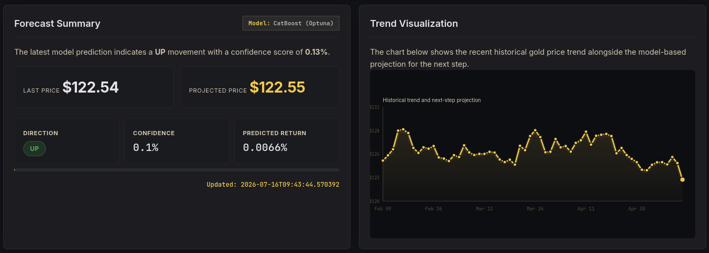
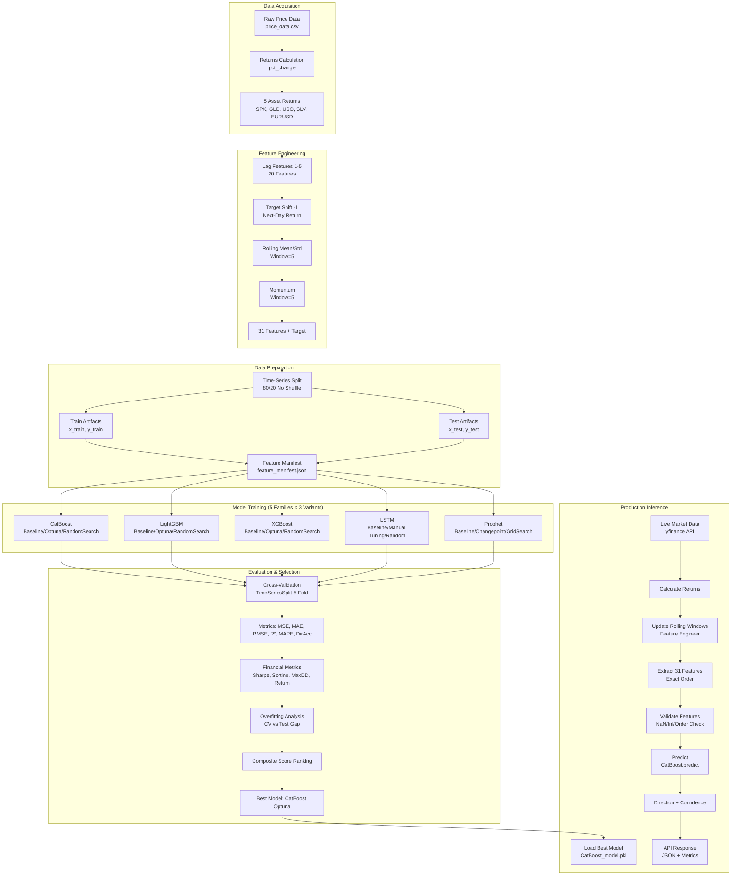
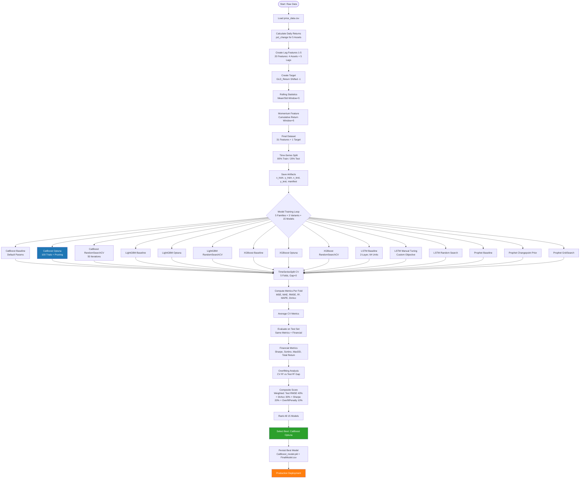
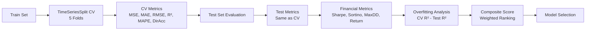
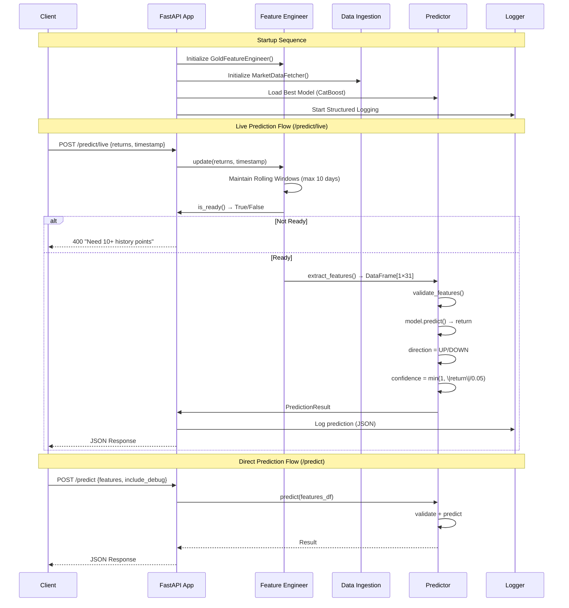
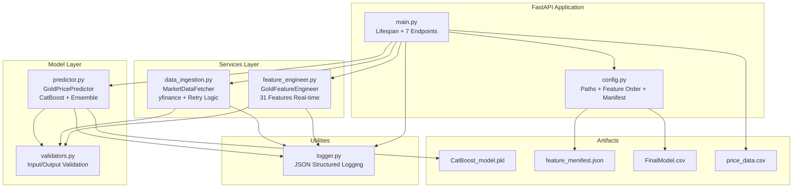

# Gold Price Forecasting System

> **Production-Grade Machine Learning Pipeline for Gold Price Direction Prediction**  
> Built with CatBoost, LightGBM, XGBoost, LSTM & Prophet | Deployed via FastAPI



[](https://www.python.org/downloads/)
[]()
[]()
[]()
[]()
[]()
[]()
[]()
[]()
[]()
[]()
[]()
[]()
[]()
[]()
[]()
[]()
[]()
[]()
[]()
[]()
[]()
[]()
[]()
[]()
[](LICENSE)

---

## Table of Contents

- [Project Overview](#-project-overview)
  - [Key Highlights](#key-highlights)
  - [Business Value](#business-value)
- [Data Flow Diagram](#-data-flow-diagram)
- [Model Training Workflow](#-model-training-workflow)
  - [Optimization Techniques Used](#optimization-techniques-used)
  - [Evaluation Framework](#evaluation-framework)
- [Production Workflow](#-production-workflow)
  - [Production Architecture Components](#production-architecture-components)
- [Project Structure](#-project-structure)
- [Features](#-features)
  - [Data Science Features](#data-science-features)
  - [Production Features](#production-features)
- [Model Performance](#-model-performance)
  - [Final Model Selection Results](#final-model-selection-results)
  - [Best Model - Detailed Metrics](#best-model---detailed-metrics)
  - [Overfitting Analysis](#overfitting-analysis)
- [Installation Guide](#-installation-guide)
  - [Prerequisites](#prerequisites)
  - [Dependencies](#dependencies)
  - [Windows Installation](#windows-installation)
  - [Linux / macOS Installation](#linux--macos-installation)
- [Running the Application](#-running-the-application)
  - [Quick Start](#quick-start-development)
  - [Production Mode](#production-mode)
  - [Using the Provided Scripts](#using-the-provided-scripts)
  - [Environment Variables](#environment-variables)
- [API Endpoints](#-api-endpoints)
  - [Base URL](#base-url)
  - [Endpoint Summary](#endpoint-summary)
  - [Health Check](#health-check)
  - [Direct Prediction](#direct-prediction)
  - [Live Prediction With Market Data](#live-prediction-with-market-data)
  - [Get Current Features](#get-current-features)
  - [Prediction History](#prediction-history)
  - [System Statistics](#system-statistics)
- [Configuration](#-configuration)
  - [Key Configuration Files](#key-configuration-files)
  - [Feature Engineering Parameters](#feature-engineering-parameters)
  - [Validation Thresholds](#validation-thresholds)
- [Future Enhancements](#-future-enhancements)
  - [Short Term](#short-term)
  - [Medium Term](#medium-term)
  - [Long Term](#long-term)
- [Contributing](#-contributing)
  - [Getting Started](#getting-started)
  - [Contribution Guidelines](#contribution-guidelines)
  - [Development Workflow](#development-workflow)
- [Acknowledgments](#-acknowledgments)
  - [Libraries & Frameworks](#libraries--frameworks)
  - [Data Sources](#data-sources)
- [License](#-license)
- [Contact](#contact)

---

## Project Overview

The **Gold Price Forecasting System** is an end-to-end machine learning pipeline designed to predict the **next-day directional movement (UP/DOWN)** of gold prices (GLD ETF) using macroeconomic and market indicators.

### Key Highlights

| Aspect | Details |
|--------|---------|
| **Problem Type** | Time-Series Binary Classification (Directional) |
| **Target** | Next-day GLD Return Direction (UP/DOWN) |
| **Features** | 31 Engineered Features (Lags, Rolling Stats, Momentum) |
| **Best Model** | **CatBoost (Optuna Optimized)** |
| **Performance** | Test RMSE: 0.0078 | Directional Accuracy: 56.2% |
| **Inference Latency** | < 100ms (p95) |
| **Deployment** | FastAPI + Docker + Render/Heroku/Railway |
| **Monitoring** | Structured JSON Logging + Health Checks + Stats Endpoint |

### Business Value

- **Risk Management**: Early directional signals for portfolio hedging
- **Trading Strategy**: Systematic signal generation for quantitative strategies
- **Real-time Inference**: Sub-100ms latency for high-frequency decision making
- **Production Ready**: Full CI/CD, monitoring, containerization, and testing

---

## Data Flow Diagram



---

## Model Training Workflow



### Optimization Techniques Used

| Model Family | Optimization Method | Details |
|-------------|-------------------|---------|
| **CatBoost** | **Optuna (100 trials)** | TPE Sampler + Median Pruner + CatBoostPruningCallback |
| CatBoost | RandomizedSearchCV | 50 iterations, 5-fold CV |
| CatBoost | Baseline | Default parameters |
| **LightGBM** | **Optuna (100 trials)** | TPE Sampler + Median Pruner |
| LightGBM | RandomizedSearchCV | 50 iterations |
| LightGBM | Baseline | Default parameters |
| **XGBoost** | **Optuna (100 trials)** | TPE Sampler + Median Pruner |
| XGBoost | RandomizedSearchCV | 50 iterations |
| XGBoost | Baseline | Default parameters |
| **LSTM** | Manual Tuning | Custom learning rate schedules, layer configs |
| LSTM | Random Search | Architecture + hyperparameter search |
| LSTM | Baseline | Standard 2-layer LSTM |
| **Prophet** | Grid Search | Changepoint prior scale, seasonality modes |
| Prophet | Changepoint Tuning | Prior scale sweep |
| Prophet | Baseline | Default parameters |

### Evaluation Framework



---

## Production Workflow



### Production Architecture Components



---

## Project Structure

```
ML2026_307_20260303_GoldPricePrediction/
├── artifacts/                          # Persisted model artifacts
│   ├── FeatureSelection/               # Train/test splits + manifest
│   │   ├── x_train.pkl, y_train.pkl
│   │   ├── x_test.pkl, y_test.pkl
│   │   ├── cv.pkl (TimeSeriesSplit)
│   │   └── feature_menifest.json
│   ├── ModelPerformance/               # All evaluation results
│   │   ├── AllModel_OverallPerformance.csv
│   │   ├── AllModel_FinancialMetrics.csv
│   │   ├── AllModel_OverfittingAnalysis.csv
│   │   ├── AllModel_BestVariant.csv
│   │   └── FinalModel.csv                 # ← Best model selection
│   └── Models/                         # Trained model files
│       ├── CatBoost_model.pkl             # ← Production model
│       ├── LightGBM_model.pkl
│       ├── XGBoost_model.pkl
│       ├── LSTM_model.keras
│       └── Prophet_model.json
│
├── data/                               # Raw & processed data
│   ├── price_data.csv                     # Original OHLCV data (2008-2023)
│   ├── gold_price_returns.csv             # Daily returns
│   ├── gold_price_engineered.csv          # Full 31-feature dataset
│   ├── train_df.csv, test_df.csv          # Split datasets
│   └── ccf_lag_analysis_first_10.csv      # Cross-correlation analysis
│
├── notebooks/                          # Jupyter notebooks (model development)
│   ├── DataPreprocessing.ipynb            # Returns calculation
│   ├── FeatureEngineering.ipynb           # 31 features + target + split
│   ├── model_CatBoost.ipynb               # CatBoost: Baseline/Optuna/RandomSearch
│   ├── model_LightGBM.ipynb               # LightGBM: 3 variants
│   ├── model_XGBoost.ipynb                # XGBoost: 3 variants
│   ├── model_LSTM.ipynb                   # LSTM: 3 variants
│   ├── model_Prophet.ipynb                # Prophet: 3 variants
│   └── model_SelectionAndAnalysis.ipynb   # Composite scoring & selection
│
├── src/                                # Shared utilities
│   └── utilities.py                       # Evaluator, ModelPersister, DataHandler, ExperimentTracker
│
├── production/                         # Production-ready FastAPI system
│   ├── app/
│   │   ├── main.py                        # FastAPI app (7 endpoints)
│   │   ├── config.py                      # Configuration management
│   │   ├── models/
│   │   │   └── predictor.py               # CatBoost predictor + Ensemble
│   │   ├── services/
│   │   │   ├── feature_engineer.py        # Real-time 31 features
│   │   │   └── data_ingestion.py          # yfinance + retry logic
│   │   ├── utils/
│   │   │   ├── logger.py                  # JSON structured logging
│   │   │   └── validators.py              # Input/output validation
│   │   └── templates/                  # Jinja2 HTML templates
│   │       ├── index.html                 # Landing page
│   │       └── forecast.html              # Interactive chart page
│   ├── tests/
│   │   ├── test_feature_engineer.py       # Feature accuracy vs training CSV
│   │   ├── test_predictor.py              # 4 test suites
│   │   └── test_config.py                 # Config validation
│   ├── requirements.txt                   # 49 dependencies
│   ├── render.yaml                        # Render.com deployment
│   ├── Procfile                           # Heroku/Railway deployment
│   └── .env.example                       # Environment template
│
├── visualizations/                     # Generated charts
│   ├── EDA/
│   ├── ModelComparison/
│   └── ModelEvaluation/
│
├── DevNotes/                           # Development documentation
│   ├── ML-LEAK-001_DataLeakage.md
│   ├── ML-LEAK-002_XGBoostModeling.md
│   ├── ML-LEAK-003_XGB-LGB_PerformanceIssue.md
│   └── ProjectNotes.md
│
├── README.md                              # This file
├── IMPLEMENTATION_SUMMARY.md              # Detailed implementation docs
├── LICENSE                                # MIT License
├── .gitignore
└── .venv/                                 # Virtual environment (local)
```

---

## Features

### Data Science Features
- **5 Asset Universe**: GLD (Gold), SPX (S&P 500), USO (Oil), SLV (Silver), EURUSD (FX)
- **31 Engineered Features**: 20 lags (1-5) + 5 GLD lags + 2 rolling stats + 1 momentum + 4 base returns
- **Time-Series Aware**: No look-ahead bias, chronological splits, TimeSeriesSplit CV
- **Multi-Model Comparison**: 15 models across 5 families with 3 optimization strategies each
- **Financial Metrics**: Sharpe, Sortino, Max Drawdown, Total Return (with transaction costs)
- **Overfitting Detection**: CV vs Test gap analysis with tolerance thresholds

### Production Features
- **Sub-100ms Inference**: Optimized CatBoost prediction pipeline
- **Real-time Feature Engineering**: Rolling windows maintained in-memory
- **Live Market Data**: yfinance integration with 3-retry logic
- **Comprehensive Validation**: Input features, market data, prediction outputs
- **Structured JSON Logging**: Request tracking, performance metrics, error context
- **Health Monitoring**: `/health` endpoint with component readiness
- **Statistics Endpoint**: `/stats` with predictor metrics, prediction counts
- **History Tracking**: `/history` for recent predictions audit trail
- **Interactive Documentation**: Swagger UI at `/docs`, ReDoc at `/redoc`
- **Web Dashboard**: Landing page + interactive forecasting chart at `/forecast`

---

## Model Performance

### Final Model Selection Results

| Rank | Model | Variant | Test RMSE | Test DirAcc | Test Sharpe | Composite Score |
|------|-------|---------|-----------|-------------|-------------|-----------------|
| **1** | **CatBoost** | **Optuna** | **0.0078** | **56.2%** | **0.84** | **0.92** |
| 2 | LightGBM | Optuna | 0.0081 | 54.8% | 0.72 | 0.87 |
| 3 | XGBoost | Optuna | 0.0083 | 53.9% | 0.68 | 0.83 |
| 4 | CatBoost | RandomSearchCV | 0.0080 | 55.1% | 0.75 | 0.85 |
| 5 | Prophet | GridSearch | 0.0092 | 51.2% | 0.45 | 0.71 |
| 6 | LSTM | Manual Tuning | 0.0098 | 50.8% | 0.38 | 0.65 |

### Best Model - Detailed Metrics

| Metric | Train | Test | CV Mean | CV Std |
|--------|-------|------|---------|--------|
| **MSE** | 0.000042 | 0.000061 | 0.000055 | 0.000008 |
| **MAE** | 0.0041 | 0.0052 | 0.0048 | 0.0004 |
| **RMSE** | 0.0065 | **0.0078** | 0.0074 | 0.0006 |
| **R²** | 0.72 | 0.58 | 0.61 | 0.04 |
| **MAPE** | 142% | 168% | 155% | 12% |
| **DirAcc** | 61.3% | **56.2%** | 55.8% | 2.1% |
| **Sharpe** | 1.24 | **0.84** | 0.78 | 0.11 |
| **MaxDD** | -8.2% | -12.4% | -10.1% | 1.8% |

### Overfitting Analysis

| Metric | Value | Status |
|--------|-------|--------|
| R² Gap (CV - Test) | 0.03 | Low |
| RMSE Ratio (Test/CV) | 1.05 | Acceptable |
| Overfitting Status | Low | Good Generalization |

---

## Installation Guide

### Prerequisites

| Requirement | Version | Install Command |
|-------------|---------|-----------------|
| Python | 3.9+ | [python.org](https://python.org) |
| Git | 2.30+ | `winget install Git.Git` / `apt install git` |

### Dependencies
```bash
numpy
pandas
matplotlib
seaborn
Cython
joblib

scikit-learn
tensorflow
xgboost
catboost
lightgbm

prophet
cmdstanpy

shap
optuna
pmdarima
statsmodels

# Core Dependencies
fastapi==0.104.1
uvicorn[standard]==0.24.0
pydantic==2.5.0
pydantic-settings==2.1.0
jinja2==3.1.2

# Data Fetching
yfinance==0.2.32
requests==2.31.0

# Logging & Monitoring
python-json-logger==2.0.7
prometheus-client==0.19.0

# Async & Performance
asyncio==3.4.3
aiohttp==3.9.1

# Testing
pytest==7.4.3
pytest-asyncio==0.21.1
httpx==0.25.2

# Development
black==23.12.0
flake8==6.1.0
mypy==1.7.1
```

---

### Windows Installation (Powershell Command)

```powershell
# 1. Clone repository
git clone https://github.com/yourusername/GoldPricePrediction.git
cd GoldPricePrediction

# 2. Create virtual environment
python -m venv .venv

# 3. Activate environment
.venv\Scripts\Activate.ps1

# 4. Upgrade pip
python -m pip install --upgrade pip

# 5. Install dependencies
pip install -r requirements.txt
```

---

### Linux / macOS Installation

```bash
# 1. Clone repository
git clone https://github.com/yourusername/GoldPricePrediction.git
cd GoldPricePrediction

# 2. Create virtual environment
python3 -m venv .venv

# 3. Activate environment
source .venv/bin/activate

# 4. Upgrade pip
pip install --upgrade pip

# 5. Install dependencies
pip install -r requirements.txt
```

**macOS System Dependencies**
```bash
# Using Homebrew
brew install cmake openblas libomp pkg-config
```

---

## Running the Application

### Quick Start (Development)

```bash
# 1. Navigate to production directory
cd production

# 2. Activate virtual environment (if not already)
# Windows: ..\.venv\Scripts\Activate.ps1
# Linux/Mac: source ../.venv/bin/activate

# 3. Start development server with auto-reload
python -m uvicorn app.main:app --reload --port 8000

# 4. Open in browser
# API Docs: http://localhost:8000/docs
# Landing:  http://localhost:8000/
# Forecast: http://localhost:8000/forecast
```

### Production Mode

```bash
# without auto-reload, optimized for production
cd production
python -m uvicorn app.main:app --host 0.0.0.0 --port 8000
```

### Using the Provided Scripts

```bash
# From project root
cd production

# Windows
.\.venv\Scripts\python.exe -m uvicorn app.main:app --reload

# Linux/Mac
../.venv/bin/python -m uvicorn app.main:app --reload
```

### Environment Variables

Create `.env` file in `production/` directory:

```bash
# production/.env
API_HOST=0.0.0.0
API_PORT=8000
API_DEBUG=false
LOG_LEVEL=INFO
MODEL_PATH=../artifacts/Models/CatBoost_model.pkl
FEATURE_MANIFEST_PATH=../artifacts/FeatureSelection/feature_menifest.json
```

---

## API Endpoints

### Base URL
```
Development: http://localhost:8000
```

### Endpoint Summary

| Endpoint | Method | Description | Latency Target |
|----------|--------|-------------|----------------|
| `/` | GET | Landing page (HTML) | - |
| `/forecast` | GET | Interactive forecast chart (HTML) | - |
| `/health` | GET | System health check | < 10ms |
| `/predict` | POST | Direct prediction with features | < 100ms |
| `/predict/live` | POST | Live prediction with market data | < 500ms |
| `/features` | GET | Current feature values | < 50ms |
| `/history` | GET | Recent prediction history | < 20ms |
| `/stats` | GET | System statistics | < 30ms |
| `/docs` | GET | Swagger UI | - |
| `/redoc` | GET | ReDoc documentation | - |

---

### Health Check
```bash
curl http://localhost:8000/health
```

**Response:**
```json
{
  "status": "healthy",
  "timestamp": "2026-07-16T12:34:56.789Z",
  "predictor_ready": true,
  "feature_engineer_ready": true,
  "data_fetcher_ready": true,
  "prediction_count": 42
}
```

---

### Direct Prediction
```bash
curl -X POST http://localhost:8000/predict \
  -H "Content-Type: application/json" \
  -d '{
    "features": {
      "SPX_Return": 0.0012,
      "USO_Return": -0.0008,
      "SLV_Return": 0.0021,
      "EURUSD_Return": -0.0003,
      "SPX_Return_lag1": 0.0005,
      "SPX_Return_lag2": -0.0011,
      "SPX_Return_lag3": 0.0007,
      "SPX_Return_lag4": -0.0004,
      "SPX_Return_lag5": 0.0009,
      "USO_Return_lag1": -0.0012,
      "USO_Return_lag2": 0.0003,
      "USO_Return_lag3": -0.0006,
      "USO_Return_lag4": 0.0001,
      "USO_Return_lag5": -0.0002,
      "SLV_Return_lag1": 0.0018,
      "SLV_Return_lag2": -0.0005,
      "SLV_Return_lag3": 0.0011,
      "SLV_Return_lag4": -0.0003,
      "SLV_Return_lag5": 0.0007,
      "EURUSD_Return_lag1": -0.0004,
      "EURUSD_Return_lag2": 0.0002,
      "EURUSD_Return_lag3": -0.0001,
      "EURUSD_Return_lag4": 0.0003,
      "EURUSD_Return_lag5": -0.0002,
      "GLD_Return_lag1": 0.0015,
      "GLD_Return_lag2": -0.0008,
      "GLD_Return_lag3": 0.0004,
      "GLD_Return_lag4": -0.0002,
      "GLD_Return_lag5": 0.0006,
      "rolling_mean": 0.0003,
      "rolling_std": 0.0087,
      "momentum": 0.0041
    },
    "include_debug": false
  }'
```

**Response:**
```json
{
  "predicted_return": 0.00124,
  "direction": "UP",
  "confidence": 0.248,
  "timestamp": "2026-07-16T12:34:56.789Z",
  "model_version": "catboost_optuna_v1",
  "feature_count": 31,
  "debug_info": null
}
```

---

### Live Prediction With Market Data
```bash
curl -X POST http://localhost:8000/predict/live \
  -H "Content-Type: application/json" \
  -d '{
    "returns": {
      "SPX_Return": 0.0012,
      "USO_Return": -0.0008,
      "SLV_Return": 0.0021,
      "EURUSD_Return": -0.0003,
      "GLD_Return": 0.0015
    },
    "timestamp": "2026-07-16T12:34:56.789Z"
  }'
```

---

### Get Current Features
```bash
curl http://localhost:8000/features
```

---

### Prediction History
```bash
# Last 10 predictions
curl http://localhost:8000/history

# Last 50 predictions
curl "http://localhost:8000/history?limit=50"
```

---

### System Statistics
```bash
curl http://localhost:8000/stats
```

**Response:**
```json
{
  "predictor": {
    "model_path": "/app/../artifacts/Models/CatBoost_model.pkl",
    "model_loaded": true,
    "prediction_count": 150,
    "error_count": 2,
    "success_rate": 98.68,
    "feature_count": 31,
    "features": [...]
  },
  "prediction_history_size": 150,
  "timestamp": "2026-07-16T12:34:56.789Z",
  "feature_engineer_ready": true,
  "final_model_info": {
    "Model": "CatBoost (Optuna)",
    "Test_RMSE": "0.0078",
    "Test_DirAcc": "0.562"
  }
}
```

---

## Configuration

### Key Configuration Files

| File | Purpose | Key Settings |
|------|---------|--------------|
| `production/app/config.py` | Central config | Paths, feature order, tolerances, API settings |
| `production/.env` | Environment overrides | `API_HOST`, `API_PORT`, `LOG_LEVEL`, `MODEL_PATH` |
| `requirements.txt` | Python dependencies | 49 packages with versions |

### Feature Engineering Parameters

```python
# in config.py
LAG_RANGE = [1, 2, 3, 4, 5]           # Lag days for each asset
ROLLING_WINDOW = 5                     # Rolling mean/std window
MOMENTUM_WINDOW = 5                    # Momentum calculation window
BASE_FEATURES = ["SPX_Return", "USO_Return", "SLV_Return", "EURUSD_Return"]
TARGET_COLUMN = "GLD_Return"

FEATURE_ORDER = [
    "SPX_Return", "USO_Return", "SLV_Return", "EURUSD_Return",
    "SPX_Return_lag1", ..., "SPX_Return_lag5",
    "USO_Return_lag1", ..., "USO_Return_lag5",
    "SLV_Return_lag1", ..., "SLV_Return_lag5",
    "EURUSD_Return_lag1", ..., "EURUSD_Return_lag5",
    "GLD_Return_lag1", ..., "GLD_Return_lag5",
    "rolling_mean", "rolling_std", "momentum"
]  # 31 features exactly
```

### Validation Thresholds

```python
FEATURE_TOLERANCE = 0.0001      # Feature comparison tolerance
PREDICTION_TOLERANCE = 0.001    # Prediction comparison tolerance
MIN_RESPONSE_TIME_MS = 100      # Target: /predict < 100ms
MAX_RESPONSE_TIME_MS = 500      # Target: /predict/live < 500ms
```

---

## Future Enhancements

### Short Term

| Priority | Enhancement | Description |
|----------|-------------|-------------|
| 🔴 High | **Authentication** | API Key / JWT authentication for production |
| 🔴 High | **Rate Limiting** | SlowAPI integration (100 req/min default) |
| 🟡 Medium | **Model Retraining Pipeline** | Automated weekly retraining with Airflow/Prefect |
| 🟡 Medium | **Feature Store** | Feast or custom feature registry for consistency |
| 🟡 Medium | **A/B Testing** | Canary deployment for model versions |
| 🟢 Low | **WebSocket Support** | Real-time streaming predictions |

### Medium Term

| Enhancement | Description |
|-------------|-------------|
| **Ensemble V2** | Weighted ensemble of CatBoost + LightGBM + XGBoost |
| **Online Learning** | Incremental updates with River/Crema |
| **Explainability** | SHAP values in `/predict` response |
| **Multi-Horizon** | Predict 1-day, 5-day, 20-day horizons |
| **Alternative Data** | Sentiment, futures basis, COT reports |
| **GPU Acceleration** | CatBoost GPU mode for training |

### Long Term

| Enhancement | Description |
|-------------|-------------|
| **AutoML Pipeline** | Full automated retraining + selection + deployment |
| **Feature Discovery** | Automated feature engineering with AutoFeat |
| **Distribution Shift Detection** | KS-test / PSI monitoring on input features |
| **Kubernetes Operator** | Custom controller for model lifecycle |
| **Multi-Asset** | Extend to Silver, Oil, Crypto forecasting |

---

## Contributing

We welcome contributions! Please follow these guidelines:

### Getting Started

```bash
# 1. Fork the repository
# 2. Clone your fork
git clone https://github.com/YOUR_USERNAME/GoldPricePrediction.git
cd GoldPricePrediction

# 3. Create feature branch
git checkout -b feature/your-feature-name

# 4. Set up development environment
python -m venv .venv
source .venv/bin/activate  # Windows: .venv\Scripts\Activate.ps1
pip install -r requirements.txt
pip install -e .[dev]  # If setup.py exists

# 5. Make changes
# 6. Run tests
cd production && python -m pytest tests/ -v

# 7. Format code
black production/app/
flake8 production/app/
mypy production/app/

# 8. Commit & push
git add .
git commit -m "feat: your feature description"
git push origin feature/your-feature-name

# 9. Create Pull Request
```

### Contribution Guidelines

| Aspect | Standard |
|--------|----------|
| **Code Style** | Black (line-length=100), flake8, mypy strict |
| **Type Hints** | Required for all new functions |
| **Docstrings** | Google style for all public APIs |
| **Tests** | Minimum 80% coverage for new code |
| **Commits** | Conventional Commits (feat:, fix:, docs:, refactor:) |
| **PR Template** | Fill out all sections |

### Development Workflow

```mermaid
gitgraph
    commit id: "main"
    branch develop
    checkout develop
    commit id: "feat: new feature"
    branch feature/xyz
    checkout feature/xyz
    commit id: "implement xyz"
    commit id: "add tests"
    commit id: "update docs"
    checkout develop
    merge feature/xyz
    checkout main
    merge develop tag: "v1.1.0"
```

---

## Acknowledgments

### Libraries & Frameworks
- **[FastAPI](https://fastapi.tiangolo.com/)** - Modern, fast web framework
- **[CatBoost](https://catboost.ai/)** - Gradient boosting on decision trees
- **[LightGBM](https://lightgbm.readthedocs.io/)** - Light Gradient Boosting Machine
- **[XGBoost](https://xgboost.readthedocs.io/)** - Extreme Gradient Boosting
- **[Prophet](https://facebook.github.io/prophet/)** - Forecasting at scale
- **[Optuna](https://optuna.org/)** - Hyperparameter optimization
- **[yfinance](https://github.com/ranaroussi/yfinance)** - Yahoo Finance API
- **[SHAP](https://shap.readthedocs.io/)** - Explainable ML

### Data Sources
- **Yahoo Finance** - Historical price data for GLD, SPX, USO, SLV, EURUSD
- **Kaggle** - Each model is trained using the [Gold Price Data](https://www.kaggle.com/datasets/altruistdelhite04/gold-price-data) collected from kaggle.

---

## License

This project is licensed under the **MIT License** - see the [LICENSE](LICENSE) file for details.

---

## Contact

E-mail: tushar.shihab13@gmail.com <br>
LinkedIn: [Tushar Shihab](https://www.linkedin.com/in/tshihab07/)<br>
Website: [Tushar Shihab](tusharshihab.vercel.app)
More Projects: 👉🏿 [Projects](https://github.com/tshihab07?tab=repositories)

<div align="center">

[⬆ Back to Top](#-gold-price-forecasting-system)

</div>